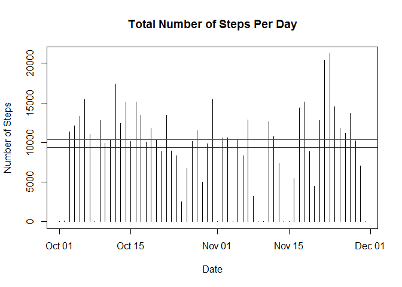

# Reproducible Research: Peer Assessment 1


## Loading and preprocessing the data

```r
if (file.exists("activity.csv")){file.remove("activity.csv")}
```

```
## [1] TRUE
```

```r
unzip('activity.zip')

activity <- read.csv("activity.csv")

activity_sum_day <- as.data.frame.table(with(activity, tapply(steps, date, sum, na.rm=TRUE)))

names(activity_sum_day) <- c("date", "steps")

activity_mean <- mean(activity_sum_day$steps)
activity_sum_day$date <- as.Date(as.character(activity_sum_day$date))
activity_summary <- summary(activity_sum_day$steps)[c(3,4)]
with(activity_sum_day, plot(date, steps, type = "h", xlab = "Date", ylab = "Number of Steps", main = "Total Number of Steps Per Day"))
abline(h=median(activity_sum_day$steps), col = "red")
abline(h=mean(activity_sum_day$steps), col = "blue")
```

<!-- -->

```r
png(filename = "./instructions_fig/num_steps_histogram.png", width = 480, height = 480, units = "px")
with(activity_sum_day, plot(date, steps, type = "h", xlab = "Date", ylab = "Number of Steps", main = "Total Number of Steps Per Day"))
abline(h=median(activity_sum_day$steps), col = "red")
abline(h=mean(activity_sum_day$steps), col = "blue")
dev.off()
```

```
## png 
##   2
```


## What is mean total number of steps taken per day?

```r
print(activity_summary)
```

```
## Median   Mean 
##  10400   9354
```

## What is the average daily activity pattern?

```r
activity_average_interval <- as.data.frame.table(with(activity, tapply(steps, as.factor(interval), sum, na.rm=TRUE)))

names(activity_average_interval) <- c("interval", "steps")
max_interval <- which.max( activity_average_interval[,2] )
maximum_step_time <- as.integer(as.character(activity_average_interval[max_interval, 1]))
with(activity_average_interval, plot(interval, steps, type = "l", xlab = "Interval", ylab = "Number of Steps", main = "Average Number of Steps in an Interval"))
abline(v=as.integer(max_interval), col = "blue")
```

<!-- -->

```r
png(filename = "./instructions_fig/activity_interval.png", width = 480, height = 480, units = "px")
with(activity_average_interval, plot(interval, steps, type = "l", xlab = "Interval", ylab = "Number of Steps", main = "Average Number of Steps in an Interval"))
abline(v=as.integer(max_interval), col = "blue")
dev.off()
```

```
## png 
##   2
```

```r
dev.off()
```

```
## null device 
##           1
```
## The interval that contains the maximum number of steps

```r
print(maximum_step_time)
```

```
## [1] 835
```

## Imputing missing values
### This will take the most amount of time, replace all NA with the mean of the respective interval associated with it.

```r
activity_new <- activity
activityna <- sum(is.na(activity$steps))
na_id <- which(is.na(activity$steps))
activity_interval_mean <- as.data.frame.table(with(activity, tapply(steps, as.factor(interval), mean, na.rm=TRUE)))
names(activity_interval_mean) <- c("interval", "steps")
ilength <- length(activity_interval_mean$interval)
for (i in 1:activityna){ for (j in 1:ilength){if (activity[na_id[i],3]==activity_interval_mean[j,1]){activity_new[na_id[i],1] <- activity_interval_mean[j,2]}else{next}}}

activity_new_sum_day <- as.data.frame.table(with(activity_new, tapply(steps, date, sum)))

names(activity_new_sum_day) <- c("date", "steps")

activity_new_mean <- mean(activity_new_sum_day$steps)
activity_new_sum_day$date <- as.Date(as.character(activity_new_sum_day$date))
activity_new_summary <- summary(activity_new_sum_day$steps)[c(3,4)]
with(activity_new_sum_day, plot(date, steps, type = "h", xlab = "Date", ylab = "Number of Steps", main = "Total Number of Steps Per Day after Impute NA"))
abline(h=median(activity_new_sum_day$steps), col = "red")
abline(h=mean(activity_new_sum_day$steps), col = "blue")
```

<!-- -->

```r
png(filename = "./instructions_fig/mean_median_after_impute.png", width = 480, height = 480, units = "px")
with(activity_new_sum_day, plot(date, steps, type = "h", xlab = "Date", ylab = "Number of Steps", main = "Total Number of Steps Per Day after Impute NA"))
abline(h=median(activity_new_sum_day$steps), col = "red")
abline(h=mean(activity_new_sum_day$steps), col = "blue")
dev.off()
```

```
## png 
##   2
```


### The mean and medium of the steps using the file after imputing

```r
print(activity_new_summary)
```

```
## Median   Mean 
##  10770  10770
```
## Are there differences in activity patterns between weekdays and weekends?

```r
library(ggplot2)
```

```
## Warning: package 'ggplot2' was built under R version 3.2.5
```

```r
activity_new$wk_day <- as.POSIXlt(as.character(activity_new$date))$wday
activity_new_weekday <- subset(activity_new, wk_day>0 & wk_day<6, select = -wk_day)
activity_new_weekend <- subset(activity_new, wk_day<1 | wk_day>5, select = -wk_day)
activity_new_weekday <- as.data.frame.table(with(activity_new_weekday, tapply(steps, as.factor(interval), mean, na.rm=TRUE)))
names(activity_new_weekday) <- c("interval", "steps")
activity_new_weekend <- as.data.frame.table(with(activity_new_weekend, tapply(steps, as.factor(interval), mean, na.rm=TRUE)))
names(activity_new_weekend) <- c("interval", "steps")
activity_new_weekday$Wday <- "Weekday"
activity_new_weekend$Wday <- "Weekend"
activity_new2 <- rbind(activity_new_weekday, activity_new_weekend)
activity_new2$interval <- as.integer(activity_new2$interval)
par(mfrow = c(2,1))
p <- ggplot(data=activity_new2, aes(x = interval, y = steps))
q <- p+ geom_line(size = 1)
r <- q+ facet_grid(Wday~.)
t <- r+ labs(title = "Weekday vs. Weekend")
ggsave("./instructions_fig/weekday_vs_weekend.png")
```

```
## Saving 7 x 5 in image
```

```r
print(t)
```

<!-- -->


### There are subtle differences comparing Weekday and Weekend Activity during most intervals
